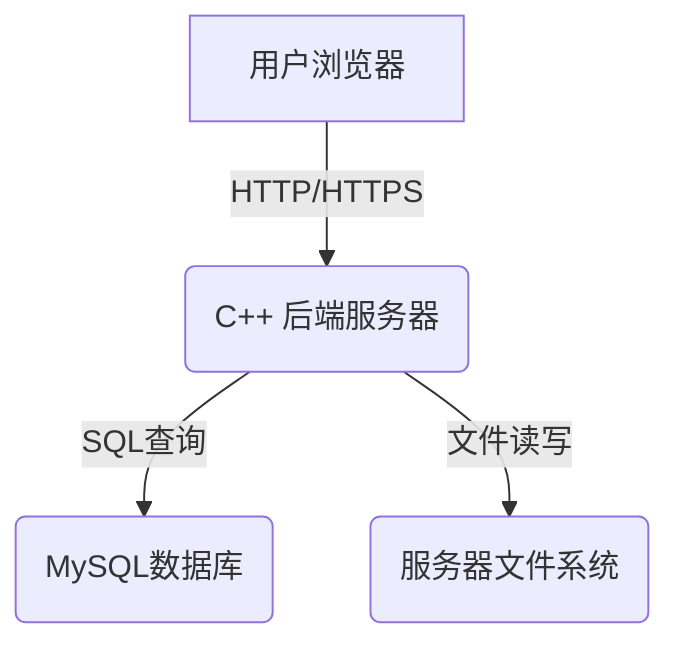

# 基于 C++ 和 muduo 的云存储项目开发文档

## 1. 项目概述

本项目旨在利用您自研的、无 Boost 依赖的 C++ muduo 网络库，构建一个功能完善、高性能的云存储（网络云盘）服务。项目后端完全使用 C++ 实现，提供文件上传、下载、管理等核心功能，并设计一个简约的 Web 前端用于用户交互。

### 核心特性：

*   **用户系统**：支持用户注册和登录。
*   **文件操作**：支持文件上传、下载、删除、列表展示。
*   **高性能后端**：基于 muduo 的事件驱动模型，实现高并发、低延迟的网络通信。
*   **前后端分离**：后端提供 RESTful API，前端通过 Web 页面与用户交互。

## 2. 系统架构设计

我们将采用经典的前后端分离架构。

*   **前端 (Client)**：
    *   技术栈：HTML + CSS + JavaScript。
    *   职责：提供用户注册、登录界面，展示文件列表，处理文件上传下载的交互逻辑。通过 AJAX 技术调用后端 API。

*   **后端 (Backend Server)**：
    *   技术栈：C++11/17, 自研 muduo 网络库。
    *   职责：实现所有业务逻辑，包括处理 HTTP 请求、用户认证、文件元数据管理、与数据库和文件系统交互。

*   **数据库 (Database)**：
    *   技术栈：MySQL (或 SQLite 用于快速原型开发)。
    *   职责：持久化存储用户信息和文件元数据。

*   **文件存储 (File Storage)**：
    *   技术栈：服务器本地文件系统。
    *   职责：实际存储用户上传的文件实体。

## 3. 核心模块划分 (后端)

后端服务可以划分为以下几个关键模块：

1.  **网络模块**：
    *   基于您的 `muduo` 库，封装 `HttpServer`。
    *   负责监听端口、接收和解析 HTTP 请求、管理 TCP 连接。
    *   将解析后的 `HttpRequest` 对象分发给业务逻辑模块。

2.  **业务逻辑模块 (API Handlers)**：
    *   实现所有 API 接口的具体处理逻辑。
    *   例如：`UserHandler` (处理注册、登录)、`FileHandler` (处理上传、下载、删除等)。
    *   负责校验请求参数、调用数据模块和文件模块完成操作。

3.  **数据持久化模块 (DAO - Data Access Object)**：
    *   封装对 MySQL 数据库的访问。
    *   提供 `UserDAO` 和 `FileDAO` 等类，用于增、删、改、查用户信息和文件元数据。
    *   屏蔽底层 SQL 细节，为业务逻辑层提供简洁的接口。

4.  **文件管理模块**：
    *   封装对服务器本地文件系统的操作。
    *   提供保存文件、读取文件、删除文件等功能。
    *   管理文件存储路径，确保文件安全。

## 4. 数据库设计

我们需要两张核心数据表：用户表和文件信息表。

### 用户表 (`user`)

| 字段名      | 类型          | 约束/备注                     |
| ----------- | ------------- | ----------------------------- |
| `id`        | `INT`         | `PRIMARY KEY`, `AUTO_INCREMENT` |
| `username`  | `VARCHAR(255)`| `UNIQUE`, `NOT NULL`            |
| `password`  | `VARCHAR(255)`| `NOT NULL` (存储哈希后的密码) |
| `create_at` | `DATETIME`    | `DEFAULT CURRENT_TIMESTAMP`   |

### 文件信息表 (`file_info`)

| 字段名      | 类型          | 约束/备注                     |
| ----------- | ------------- | ----------------------------- |
| `id`        | `INT`         | `PRIMARY KEY`, `AUTO_INCREMENT` |
| `user_id`   | `INT`         | `FOREIGN KEY` (关联 `user.id`)  |
| `file_name` | `VARCHAR(255)`| `NOT NULL` (用户看到的文件名) |
| `file_path` | `VARCHAR(512)`| `NOT NULL` (文件在服务器上的存储路径) |
| `file_size` | `BIGINT`      | `NOT NULL` (文件大小，单位: Byte) |
| `upload_at` | `DATETIME`    | `DEFAULT CURRENT_TIMESTAMP`   |

## 5. API 接口设计 (RESTful)

| 功能         | HTTP 方法 | URL 路径                  | 请求体 (Body) / 响应 (Response)                                |
| ------------ | --------- | ------------------------- | ------------------------------------------------------------ |
| **用户注册** | `POST`    | `/api/register`           | **Req**: `{"username": "...", "password": "..."}` **Res**: `{"code": 0, "msg": "success"}` |
| **用户登录** | `POST`    | `/api/login`              | **Req**: `{"username": "...", "password": "..."}` **Res**: `{"code": 0, "token": "..."}` |
| **文件上传** | `POST`    | `/api/upload`             | **Req**: `multipart/form-data` 格式 **Res**: `{"code": 0, "msg": "upload success"}` |
| **文件列表** | `GET`     | `/api/files`              | **Res**: `{"code": 0, "files": [{"name": ..., "size": ...}]}` |
| **文件下载** | `GET`     | `/api/download?file_id=...` | **Res**: 文件二进制流                                        |
| **文件删除** | `DELETE`  | `/api/delete?file_id=...` | **Res**: `{"code": 0, "msg": "delete success"}`           |

## 6. 详细开发步骤 (路线图)

### 阶段一：环境搭建与基础框架

1.  **安装依赖**：安装 `g++`, `cmake`, `mysql-server`, `mysql-client`, `libmysqlclient-dev`。
2.  **项目结构**：创建 `src`, `include`, `build`, `lib`, `bin`, `static` (存放文件) 等目录。
3.  **CMake 配置**：编写根 `CMakeLists.txt` 和各模块的 `CMakeLists.txt`，配置头文件路径、链接库 (muduo, mysqlclient)。
4.  **数据库初始化**：连接 MySQL，创建数据库和上述两张表。
5.  **启动服务器**：编写 `main.cc`，使用您的 muduo 库启动一个能响应简单 "Hello World" 的 HTTP 服务器。

### 阶段二：用户功能开发

1.  **数据库模块**：实现 `Database` 连接池和 `UserDAO`，封装对 `user` 表的增查操作。
2.  **密码学**：引入一个轻量级的 C++ 哈希库 (如 `picosha2`) 对用户密码进行 SHA256 加盐哈希。
3.  **API 实现**：在 `HttpServer` 的回调中，添加对 `/api/register` 和 `/api/login` 路由的处理逻辑。
4.  **前端页面**：编写 `register.html` 和 `login.html`，使用 `fetch` API 调用后端接口。

### 阶段三：核心文件功能开发

1.  **DAO 扩展**：实现 `FileDAO`，封装对 `file_info` 表的增删改查。
2.  **文件上传**：
    *   这是最复杂的部分。您需要解析 `multipart/form-data` 格式的 HTTP 请求体。
    *   在 `HttpRequest` 中找到 `boundary`，然后逐段解析出文件元信息和文件内容。
    *   将文件内容写入到 `static` 目录下的一个唯一路径中。
    *   将文件元数据写入 `file_info` 表。
3.  **文件列表**：实现 `/api/files` 接口，从数据库查询并返回指定用户的文件列表。
4.  **文件下载**：实现 `/api/download` 接口，根据 `file_id` 从数据库找到文件路径，读取文件内容并作为 `HttpResponse` 的 body 返回。
5.  **文件删除**：实现 `/api/delete` 接口，从数据库删除记录，并从文件系统中删除实际文件。

### 阶段四：前端整合与完善

1.  **主界面**：创建 `index.html`，在用户登录后展示文件列表。
2.  **前端逻辑**：使用 JavaScript 实现文件列表的动态渲染、上传进度条、下载和删除按钮的事件绑定。
3.  **Token/Session**：在登录成功后，前端保存后端返回的 `token`，并在后续请求的 Header 中携带，用于身份认证。

## 7. 未来功能展望

*   **大文件/断点续传**：将大文件分块 (chunk) 上传，并记录上传进度。
*   **秒传功能**：通过计算文件哈希值 (MD5/SHA256)，如果服务器已存在相同文件，则直接建立关联，无需重复上传。
*   **文件分享**：生成分享链接，支持设置有效期和访问密码。
*   **目录/文件夹功能**：扩展数据库设计，支持文件夹层级结构。
*   **容器化部署**：使用 Docker 将整个服务打包，简化部署流程。

---
*祝您项目开发顺利！*